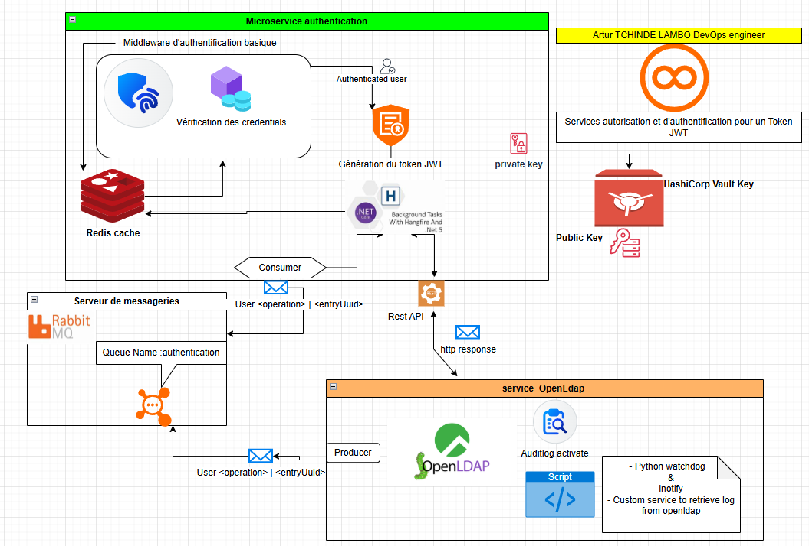

# 🔐 Auth‑Microservice

[](#) 
[](#)  
[](#)
[](#)
[](https://codecov.io/gh/<OWNER>/<REPO>)

**NB** : Vous trouverez ci-bas un schéma récapitulatif du projet

🧰 Contexte du projet
Dans le cadre du projet de gestion des ressources humaines développé pour notre portfolio, ce microservice joue le rôle de solution de secours (fallback) à Keycloak, notre fournisseur d’identité principal.

⚙️ Fonctionnalités principales
Il prend en charge :

✅ Authentification des utilisateurs présents dans un annuaire LDAP

🔑 Génération de tokens JWT (access et refresh)

🔁 Redis pour la gestion du cache des tokens (stockage temporaire performant)

📬 RabbitMQ pour la communication asynchrone entre OpenLDAP et l’application (ex. notification de mise à jour des comptes)

🔐 HashiCorp Vault pour la gestion sécurisée des secrets (tokens, clés, credentials)

📦 Déploiement conteneurisé et modulaire via Docker

💡 Ce composant s’intègre facilement dans une architecture microservices, tout en assurant :

🔒 Sécurité renforcée grâce à Vault

📊 Auditabilité via Trivy & SonarQube

♻️ Fiabilité en cas d’indisponibilité de la solution principale

⚙️ Interopérabilité avec les services d’identité standards


## 🧭 Table des matières

- [📦 Installation](#-installation)
- [🚀 Démarrage](#-démarrage)
- [🧩 Architecture](#-architecture)
- [🧪 Tests](#-tests)
- [⚙️ CI/CD & Qualité](#-cicd--qualité)
- [🤝 Contribuer](#-contribuer)
- [📄 Licence](#-licence)

---

## 📦 Installation

### Prérequis

- [.NET SDK](https://dotnet.microsoft.com/)
- Docker / Docker Compose
- Git

```bash
git clone https://github.com/LAMBOFIRSTECH/Auth-microservice.git
cd Auth-microservice  
```

## 🚀 Démarrage
Tout d'abord on a besoin d'un certains nombres de services actifs avant de pouvoir tester l'application

1. Installer redis (docker) pour le cache token et refresh token
2. Installer openldap(docker) comme source de stockage de compte utilisateur
3. Installer rabbitMQ (docker) serveur de messagerie permettant la notification entre openldap et l'applicatif
4. `cd Authentifications`
5. `dotnet run Authentifications`
6. `dotnet test Authentifications.Tests`

## 🧩  Architecture


## ⚙️ CI/CD & Qualité
- Trivy pour l'mage docker : `./trivy.sh`
- SonarQube : `./sonar_check.sh`, `./sonar_report.sh`
- Scan des vulnérabilités fichier système : `fs_trivy_vulnerabilities.py`

## 🤝 Contribuer
Fork → Branche → PR…